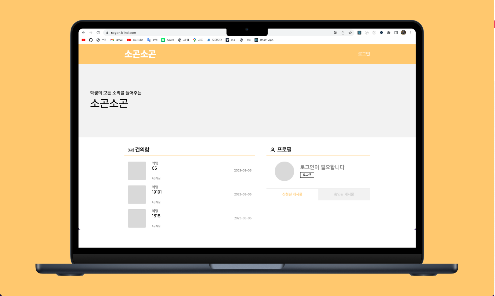
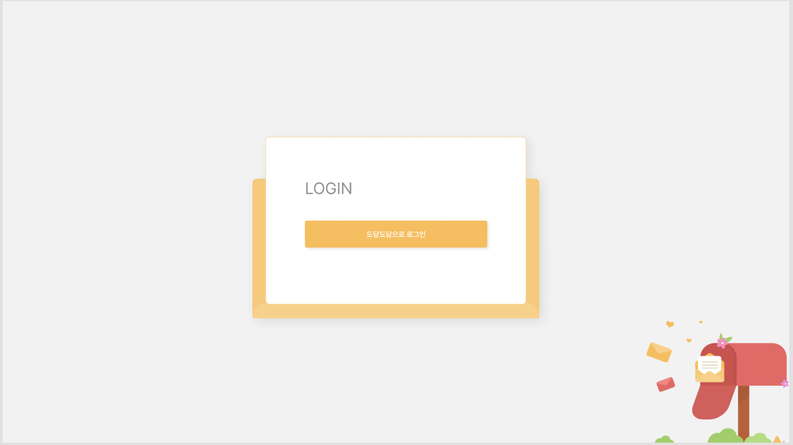
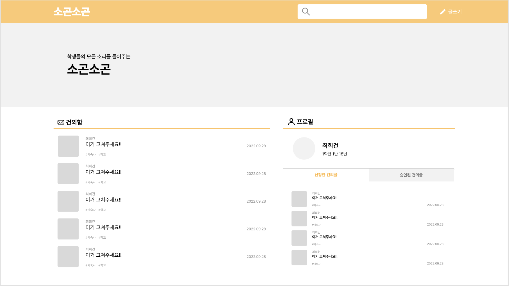
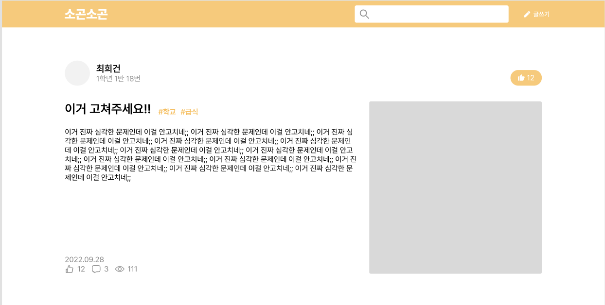
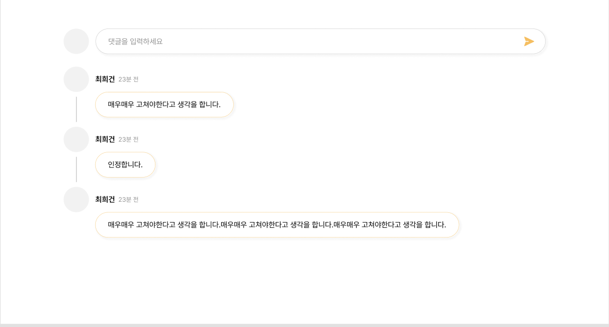
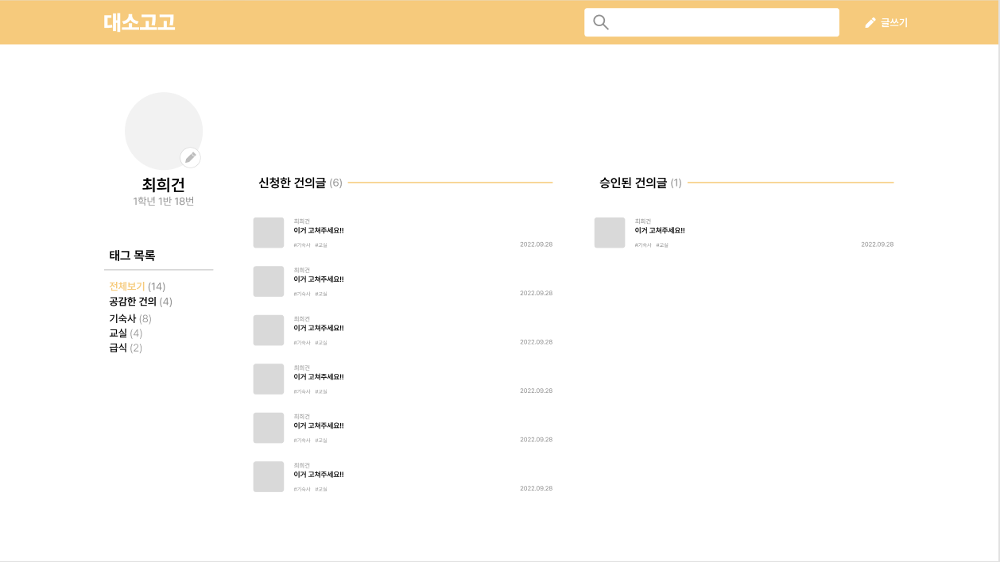
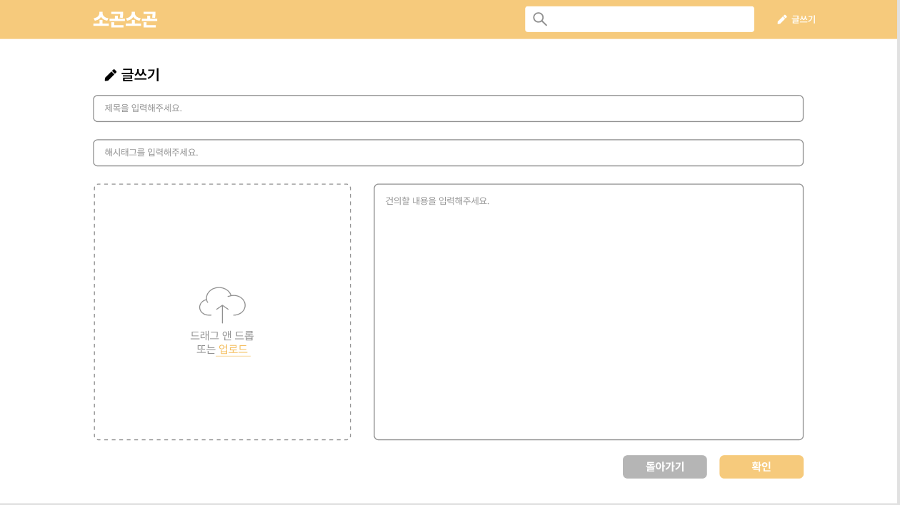
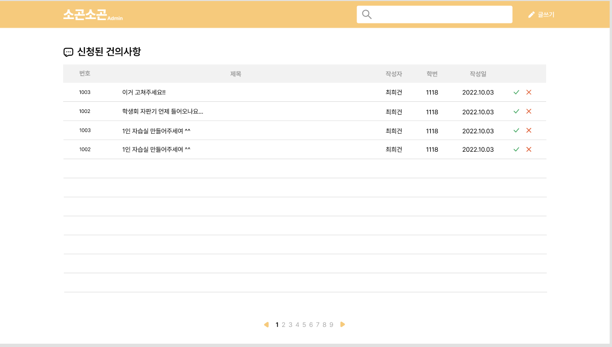

# [Dpply](https://sogon.b1nd.com/)

  

소곤소곤(Dpply)은 학생들이 간편하게 학생회에게 건의를 할 수 있도록 하기 위해 제작된 교내 학생 건의 사이트에요.

> 아쉽지만 해당 서비스는 Dauth 로그인만 지원하고 있어, 대소고학생 들만 사용할 수 있어요 🥲

# 프로젝트 기능

- 건의 기능
  - 학생들이 건의를 생성, 삭제, 수정하여 학생회에게 건의합니다.
- 건의 공감 기능
  - 학생들이 대기중인 건의를 좋아요로 공감 할 수 있고 댓글을 달 수 있습니다.
- 건의 수락 기능
  - 어드민이 건의를 수락, 거절 할 수 있습니다.

# Dpply 화면

> 위 사진은 로그인 페이지에요. Dauth(도담도담 OAuth)를 통해 로그인 가능해요.

> 위 사진은 Dpply의 메인페이지에요. 현재 건의되고있는 건의리스트와과 내 건의리스트를 볼 수 있어요.

> 위 사진은 건의 상세페이지 상단부에요. 건의 내용을 상세하게 확인할 수 있고 좋아요를 누를 수 있어요.

> 위 사진은 건의 상세페이지 하단부에요. 건의에 대한 댓글을 달 수 있어요.

> 위 사진은 내 프로필 페이지에요. 자신이 신청한 건의와 승인된 건의를 확인할 수 있어요.

> 위 사진은 건의 작성 페이지에요, 제목, 해시태그, 사진, 내용을 입력해서 건의를 등록할 수 있어요.

> 위 사진은 관리자 페이지에요. 건의된 건의들을 승인하고 거절할 수 있어요.

# 기술 스택

`TypeScript`, `React`, `React-Query`, `Styled-Components`, `Axios`

# 링크

https://sogon.b1nd.com/
